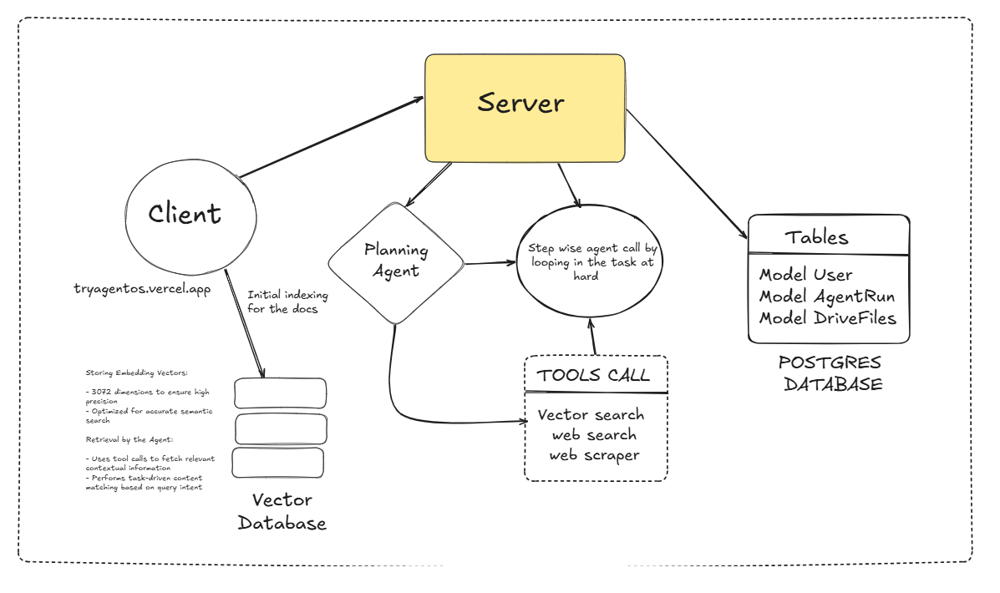
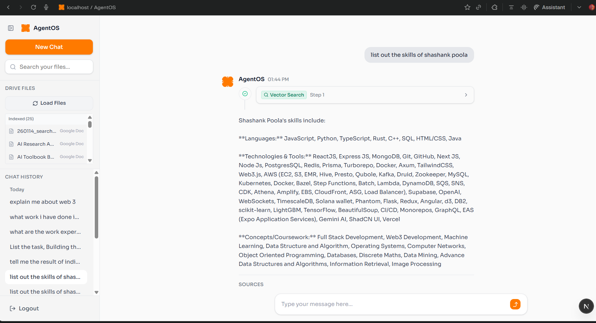

## AgentOS monorepo (agent)

AgentOS is an autonomous AI agent platform that accepts natural language tasks, dynamically plans execution steps, selects and runs tools (web search, web scraping, vector search, and Google Drive retrieval), and iteratively refines results using LLM reasoning.

It integrates Google Drive with OAuth, performs document ingestion and semantic search using embeddings, and presents structured, source-cited responses through a modern chat-based UI.

## Architecture of AgentOS



## Live Preview



### Project layout

- `agent/apps/web`: Next.js + React web app
- `agent/apps/api`: Bun + Express API
- `agent/packages/ui`: shared UI components (shadcn/ui, Tailwind)
- `agent/packages/database`: shared database layer

### Getting started

1. **Install requirements**
   - Node \(>= 20\)
   - [Bun](https://bun.sh) \(used as the package manager and runtime\)

2. **Install dependencies**

   ```bash
   cd agent
   bun install
   ```

3. **Run the dev servers**

   ```bash
   bun run dev
   ```

   This uses Turborepo to start the web app (and any other apps) in watch mode.

### Main tools & libraries used

- **Bun**: package manager and runtime for scripts and the API.
- **Turborepo**: runs builds, dev servers, and linting across the monorepo.
- **Next.js & React**: framework and library for the web frontend in `apps/web`.
- **shadcn/ui**: headless, themeable UI components used in the shared `ui` package.
- **Tailwind CSS**: utility‑first styling integrated with the `ui` components.
- **lucide-react**: icon library for the web UI.
- **TypeScript**: type‑safe JavaScript across apps and packages.
- **ESLint & custom eslint-config**: linting and code quality.
- **Prettier**: opinionated code formatter.
- **Express (via Bun)**: HTTP server for the API in `apps/api`.
- **Zod**: schema validation for API inputs and data.
- **Qdrant JS client**: vector database client for semantic search/storage.
- **Google GenAI SDK**: connects the API to Google’s generative AI models.

### Common scripts

Run these from inside `agent`:

- **`bun run dev`**: start all apps in dev mode.
- **`bun run build`**: build all apps and packages.
- **`bun run lint`**: run ESLint via Turborepo.

